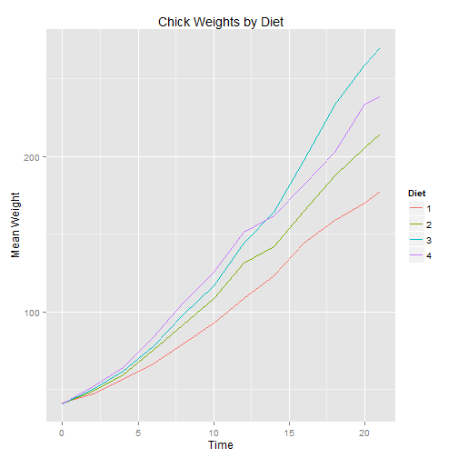

## Application Description

The application allows the user to explore the effects of diet on early growth of chicks. 

Utilizing the app users are able to:

-  select the format in which to view the results, either a line or trellis graph
-  select whether to view an overview of all four diets or view detailed data for each diet
-  view the data either graphically via the plot tab or in summary format
      on the summary tab

The app can be found here <a href="https://basel.shinyapps.io/ChickWeight/"> https://basel.shinyapps.io/ChickWeight/</a>

The code files are on github. <a href="https://github.com/AlexLlewellyn/DevelopingDataProducts"> https://github.com/AlexLlewellyn/DevelopingDataProducts </a>


--- 

## The Data

The data for this application is the ChickWeight dataset taken from the dataset package in R. This data was taken from an experiment on the effect of diet on early growth of chicks.

The body weights of the chicks were measured at birth and every second day thereafter until day 20. They were also measured on day 21. There were four groups on chicks on different protein diets.

Here is an example of the raw data


```r
head(ChickWeight)
```

```
##   weight Time Chick Diet
## 1     42    0     1    1
## 2     51    2     1    1
## 3     59    4     1    1
## 4     64    6     1    1
## 5     76    8     1    1
## 6     93   10     1    1
```


---

## Data Structure

The ChickWeight data frame has 578 rows and 4 columns

It has 4 variables
- weight
   -  a numeric vector giving the body weight of the chick (gm).
- Time 
   - a numeric vector giving the number of days since birth when the measurement was made.
- Chick
   - an ordered factor with levels 18 < ... < 48 giving a unique identifier for the chick. The ordering of the levels groups chicks on the same diet together and orders them according to their final weight (lightest to heaviest) within diet.
- Diet
   - a factor with levels 1, ..., 4 indicating which experimental diet the chick received.

---

## The graphs

The graphs were constructed using ggplot. Here is the resulting line graph for all diets.

 


